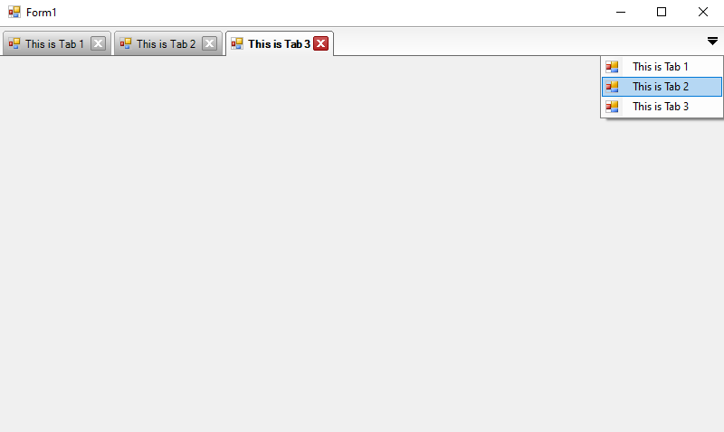

# MDI TAB CONTROL

A highly configurable MDI tab control for c# to use as tabbed MDI forms ...

## FEATURES OF THIS CONTROL
This tab control is specific to creating a MDI interface with one tab page for each form. Some of the behaviours that were implemented are:
1. Always open the new page at the first tab
2. Hide the tab pages that can't fit in the screen
3. Don't scroll tab pages, instead, bring a hidden tab page to the first position when it's selected
4. Have a list of the tab pages (forms) in a drop down menu
5. Ability to reorder tabs by dragging
6. Easy owner draw
7. Close button at the tab
8. Clicking on overlapped part of the tab does not select the other tab and also
9. Clicking outside the border doesn't select the tab (achieved by the Region property)
10. Expose the maximum of functionality and configurability as possible
11. Very simple to use

## WHAT CAN BE CUSTOMIZED IN THIS CONTROL
Almost everything. To understand the control, let's take a look at the objects and regions.

* The first two lines are the TopSeparator
* Followed by the TabTop
* On the left the Tabs area
* On the right the Control Buttons area
* The space between the tabs is the TabOffset
* All the bottom part is the form

## HOW TO USE THIS CONTROL
* <a href="https://github.com/JacksiroKe/MdiTabCtrl/wiki">MDI Tab Control Wiki</a>

## Nuget Package
* <a href="https://www.nuget.org/packages/MdiTabCtrl/">MDI Tab Control</a>