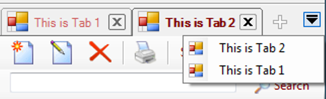

# MDI TAB CONTROL

A highly configurable MDI tab control for c# to use as tabbed MDI forms ...

## FEATURES OF THIS PLUGIN
This tab control is specific to creating a MDI interface with one tab page for each form. Some of the behaviours that were implemented are:
1. Always open the new page at the first tab
2. Hide the tab pages that can't fit in the screen
3. Don't scroll tab pages, instead, bring a hidden tab page to the first position when it's selected
4. Have a list of the tab pages (forms) in a drop down menu
5. Ability to reorder tabs by dragging
6. Easy owner draw
7. Close button at the tab
8. Clicking on overlapped part of the tab does not select the other tab and also
9. Clicking outside the border doesn't select the tab (achieved by the Region property)
10. Expose the maximum of functionality and configurability as possible
11. Very simple to use

## ADDING THE CONTROL TO YOUR TOOLBOX
1. In Solution Explorer, right-click the project node and click Add Reference.
2. In the Add Reference dialog box, browse to the dll in the packages folder in this attached project.
3. Select the tab control dll, and then click OK. Tip.
4. Right-click on toolbox
5. select "Choose Items"
6. Browse to that DLL again.
7. Select the TabControl

## WHAT CAN BE CUSTOMIZED
Almost everything. To understand the control, let's take a look at the objects and regions.

* The first two lines are the TopSeparator
* Followed by the TabTop
* On the left the Tabs area
* On the right the Control Buttons area
* The space between the tabs is the TabOffset
* All the bottom part is the form

The tab is composed of the following areas from left to right:
* TabPadLeft
* Icon
* Text
* CloseButton
* TabPadRight

Most customizations are made through properties. All the properties are in the TabControl, and some of them are in the TabPage, so you can change some appearance on each specific tab.

The icon and the text in the tab are the Icon and Text properties of the form, respectively. All the colors in the control can be changed. The close button in the tab can be replaced by an image. The TopSeparator, the tab icon, the tab Close button, and the control buttons can be displayed or not. And there is a lot more. Look at the control to see what’s possible.

The tab shape can be changed by the GetTabRegion event. The tab background can be OwnerDraw by the event TabPaintBackGround, and the border can be handled by the event TabPaintBorder. The events occur in the order mentioned.

## USING THE CONTROL
* To use the control, you first need to add it to a form. Ideally, you should dock the control in it. After that, you can change all the properties through the designer.

* To insert a TabPage (form) in the control:

  Form cform; //Declare child Form
  cform = new ChildForm(); //call an instance of a class you want to show in a tab
  tabcount = tabcount + 1;
  cform.Text = "This is Tab " + tabcount; //Declare text for this tab
  TabControl1.TabPages.Add(cform);

* You don't show the form, instead you just add it to the control. Very simple, isn't it? On an existing program, you just need to add the control to the main form, and where you have the Show call for the form, you just replace by the Add method.
  TabControl1.TabPages.Add(cform);
 
